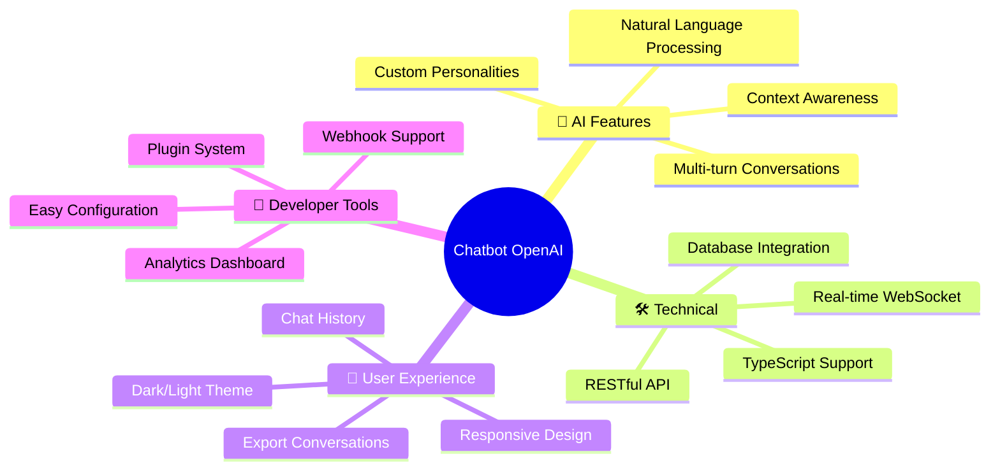
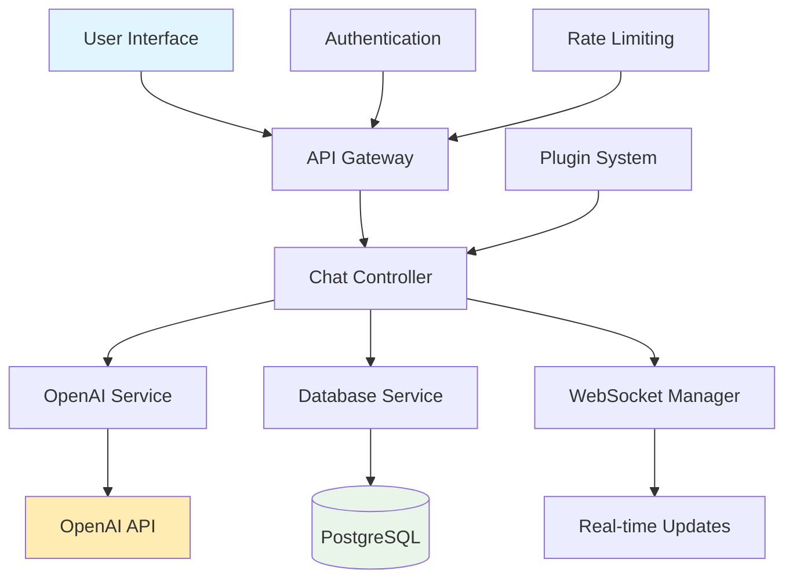
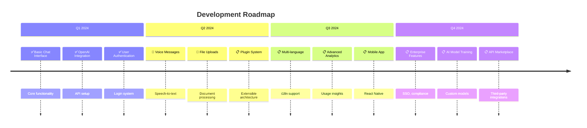

<div align="center">

<h1>OPENAI CHATBOT</h1>

<h3>🤖 Your Next-Generation AI Conversation Partner 🚀</h3>

[](https://openai.com/)
[](https://typescriptlang.org/)
[](https://nodejs.org/)
[](https://reactjs.org/)

[](LICENSE)
[](https://github.com/venom/chatbot-openai/stargazers)
[](https://github.com/venom/chatbot-openai/issues)

</div>

---

## 🌟 What Makes This Special?

<table>
<tr>
<td width="33%" align="center">

### 🧠 **Smart Conversations**
Powered by OpenAI's latest models
for human-like interactions

</td>
<td width="33%" align="center">

### ⚡ **Lightning Fast**
Optimized performance with
real-time responses

</td>
<td width="33%" align="center">

### 🎨 **Beautiful UI**
Modern, responsive design
that adapts to any device

</td>
</tr>
</table>

## 🎯 Features



## 🚀 Quick Start

### Prerequisites

Before you begin, ensure you have:

- 📦 **Node.js** (v18.0.0 or higher)
- 🔑 **OpenAI API Key** 
- 💾 **Git** installed

### Installation

1. **Clone the repository**
   ```bash
   git clone https://github.com/venom/chatbot-openai.git
   cd chatbot-openai
   ```

2. **Install dependencies**
   ```bash
   npm install
   # or
   yarn install
   ```

3. **Set up environment variables**
   ```bash
   cp .env.example .env
   ```
   
   Edit `.env` file:
   ```env
   OPENAI_API_KEY=your_openai_api_key_here
   DATABASE_URL=your_database_url
   PORT=3000
   ```

4. **Start the development server**
   ```bash
   npm run dev
   ```

🎉 **That's it!** Open [http://localhost:3000](http://localhost:3000) and start chatting!

## 💬 Usage Examples

### Basic Chat Integration

```typescript
import { ChatBot } from './src/chatbot';

const bot = new ChatBot({
  apiKey: process.env.OPENAI_API_KEY,
  model: 'gpt-4',
  temperature: 0.7
});

// Simple conversation
const response = await bot.chat("Hello, how are you?");
console.log(response.message); // AI response
```

### Advanced Configuration

```typescript
const advancedBot = new ChatBot({
  apiKey: process.env.OPENAI_API_KEY,
  model: 'gpt-4',
  systemPrompt: "You are a helpful coding assistant",
  maxTokens: 1000,
  temperature: 0.3,
  plugins: ['code-formatter', 'syntax-highlighter']
});
```

## 🏗️ Architecture



## 📁 Project Structure

```
chatbot-openai/
├── 📁 src/
│   ├── 📁 components/     # React components
│   ├── 📁 services/       # API services
│   ├── 📁 utils/          # Utility functions
│   ├── 📁 types/          # TypeScript types
│   └── 📄 app.ts          # Main application
├── 📁 public/             # Static assets
├── 📁 tests/              # Test files
├── 📄 package.json
├── 📄 tsconfig.json
└── 📄 README.md
```


## 🛣️ Roadmap



## 🤝 Contributing

We love contributions! Here's how you can help:

### 🐛 Found a Bug?
1. Check if it's already reported in [Issues](https://github.com/venom/chatbot-openai/issues)
2. Create a new issue with detailed description
3. Include steps to reproduce

### 💡 Have an Idea?
1. Open a [Discussion](https://github.com/venom/chatbot-openai/discussions)
2. Describe your feature request
3. Get community feedback

### 🔧 Want to Code?
1. Fork the repository
2. Create a feature branch: `git checkout -b feature/amazing-feature`
3. Commit your changes: `git commit -m 'Add amazing feature'`
4. Push to branch: `git push origin feature/amazing-feature`
5. Open a Pull Request


## 📜 License

This project is licensed under the MIT License - see the [LICENSE](LICENSE) file for details.

## 🙏 Acknowledgments

- 🤖 **OpenAI** for providing the amazing GPT models
- 💻 **The open source community** for inspiration and tools
- 🎨 **All contributors** who helped shape this project

## 🔗 Links

- 📖 [Documentation](https://docs.example.com)
- 🐛 [Report Bug](https://github.com/venom/chatbot-openai/issues)
- 💡 [Request Feature](https://github.com/venom/chatbot-openai/issues)
- 💬 [Join Discord](https://discord.gg/example)
- 🐦 [Follow on Twitter](https://twitter.com/example)

---

<div align="center">

**Made with ❤️ by the ChatBot OpenAI team**

⭐ **Star this repo if you find it helpful!** ⭐

</div>