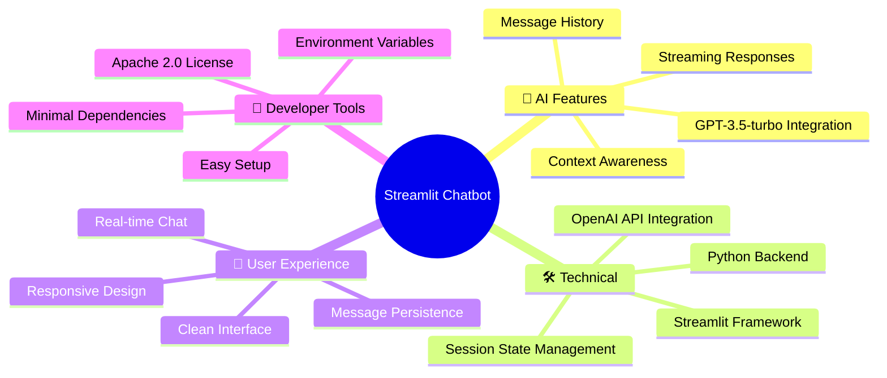
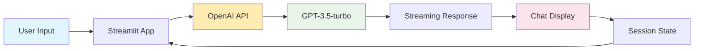

<div align="center">

<h1>🤖  OpenAI Chatbot </h1>

<h3>🤖 Streamlit-Powered OpenAI Chatbot 🚀</h3>

[](https://openai.com/)
[](https://python.org/)
[](https://streamlit.io/)

[](LICENSE)
[](https://python.org/)

</div>

---

## 🌟 What Makes This Special?

<table>
<tr>
<td width="33%" align="center">

### 🧠 **Smart Conversations**
Powered by OpenAI's GPT-3.5-turbo
for intelligent responses

</td>
<td width="33%" align="center">

### ⚡ **Simple & Fast**
Built with Streamlit for
instant deployment

</td>
<td width="33%" align="center">

### 🎨 **Clean Interface**
Beautiful, responsive chat UI
with message persistence

</td>
</tr>
</table>

## 🎯 Features



## 🚀 Quick Start

### Prerequisites

Before you begin, ensure you have:

- 🐍 **Python** (3.8 or higher)
- 🔑 **OpenAI API Key** ([Get one here](https://platform.openai.com/account/api-keys))
- 💾 **Git** installed

### Installation

1. **Clone the repository**
   ```bash
   git clone https://github.com/venom/chatbot-openai.git
   cd chatbot-openai
   ```

2. **Install dependencies**
   ```bash
   pip install -r requirements.txt
   ```

3. **Set up environment variables (optional)**
   ```bash
   cp .env.example .env
   # Edit .env file with your OpenAI API key
   ```

4. **Run the application**
   ```bash
   streamlit run app.py
   ```

5. **Enter your OpenAI API Key**
   - Open the app in your browser (usually http://localhost:8501)
   - Enter your OpenAI API key in the input field (if not set in environment)
   - Start chatting!

🎉 **That's it!** Your chatbot is ready to use!

## 💬 Usage

### Getting Your API Key
1. Visit [OpenAI Platform](https://platform.openai.com/account/api-keys)
2. Create an account or sign in
3. Generate a new API key
4. Copy and paste it into the app

### Alternative: Using Secrets
You can also store your API key in Streamlit secrets:

1. Create `.streamlit/secrets.toml` file:
   ```toml
   OPENAI_API_KEY = "your-api-key-here"
   ```

2. Access it in code:
   ```python
   openai_api_key = st.secrets["OPENAI_API_KEY"]
   ```

## 🏗️ How It Works



## 📁 Project Structure

```
chatbot-openai/
├── 📄 app.py                    # Main application entry point
├── 📄 requirements.txt          # Python dependencies
├── 📄 .env.example             # Environment variables template
├── 📄 .gitignore               # Git ignore rules
├── 📄 LICENSE                  # Apache 2.0 License
├── 📄 README.md                # This file
├── 📁 src/                     # Source code package
│   ├── 📄 __init__.py          # Package initialization
│   ├── 📁 config/              # Configuration management
│   │   └── 📄 settings.py      # App settings and config
│   ├── 📁 services/            # Business logic services
│   │   └── 📄 openai_service.py # OpenAI API service
│   ├── 📁 ui/                  # User interface components
│   │   ├── 📄 main.py          # Main UI orchestration
│   │   └── 📄 components.py    # Reusable UI components
│   └── 📁 utils/               # Utility functions
│       └── 📄 session_manager.py # Session state management
├── 📁 tests/                   # Test files (future)
├── 📁 docs/                    # Documentation (future)
└── 📁 .streamlit/              # Streamlit configuration
    └── 📄 secrets.toml         # API key storage (optional)
```

## 🔧 Code Overview

The chatbot is built with just a few key components:

```python
# OpenAI client initialization
client = OpenAI(api_key=openai_api_key)

# Session state for message persistence
if "messages" not in st.session_state:
    st.session_state.messages = []

# Streaming response generation
stream = client.chat.completions.create(
    model="gpt-3.5-turbo",
    messages=st.session_state.messages,
    stream=True
)
```

## 🆕 New Features

### 🔧 Enhanced Configuration
- **Multiple model support** (GPT-3.5, GPT-4, GPT-4-turbo)
- **Temperature control** for response creativity
- **Environment variable support** for API keys
- **Centralized settings management**

### 🎨 Improved UI
- **Sidebar configuration panel**
- **Model selection dropdown**
- **Clear conversation button**
- **Export conversation feature**
- **Better error handling and validation**

### 🏗️ Better Architecture
- **Modular code structure** with separate concerns
- **Service layer** for OpenAI API interactions
- **Reusable UI components**
- **Session state management utilities**
- **Configuration management system**

## 🎨 Screenshots


## 🛣️ Features & Roadmap

- ✅ **OpenAI GPT Integration** (3.5-turbo, GPT-4)
- ✅ **Streamlit Web Interface**
- ✅ **Message History Persistence**
- ✅ **Streaming Responses**
- ✅ **Secure API Key Input**
- ✅ **Model Selection**
- ✅ **Temperature Control**
- ✅ **Conversation Export**
- ✅ **Modular Architecture**
- 📋 **Custom System Prompts**
- 📋 **File Upload Support**
- 📋 **Dark/Light Theme Toggle**
- 📋 **Conversation Management**
- 📋 **User Authentication**

## 🤝 Contributing

Contributions are welcome! Here's how you can help:

### 🐛 Found a Bug?
1. Check existing [Issues](https://github.com/venom/chatbot-openai/issues)
2. Create a new issue with steps to reproduce
3. Include error messages and screenshots

### 💡 Feature Ideas?
1. Open a [Discussion](https://github.com/venom/chatbot-openai/discussions)
2. Describe your feature request
3. Explain the use case

### 🔧 Want to Contribute Code?
1. Fork the repository
2. Create a feature branch: `git checkout -b feature/my-feature`
3. Make your changes
4. Test thoroughly
5. Submit a pull request

## 📚 Learn More

- 📖 [Streamlit Documentation](https://docs.streamlit.io/)
- 🤖 [OpenAI API Documentation](https://platform.openai.com/docs/)
- 🎓 [Building Conversational Apps Tutorial](https://docs.streamlit.io/develop/tutorials/llms/build-conversational-apps)

## 🔒 Security Notes

- Never commit your API keys to version control
- Use environment variables or Streamlit secrets for production
- Be mindful of API usage limits and costs
- Consider implementing rate limiting for production deployments

## 📜 License

This project is licensed under the Apache License 2.0 - see the [LICENSE](LICENSE) file for details.

## 🙏 Acknowledgments

- 🤖 **OpenAI** for the amazing GPT models
- 🎈 **Streamlit** for the fantastic framework
- 💻 **The Python community** for excellent libraries

---

<div align="center">

**Made with ❤️ using Streamlit and OpenAI**

⭐ **Star this repo if you find it helpful!** ⭐

</div>
